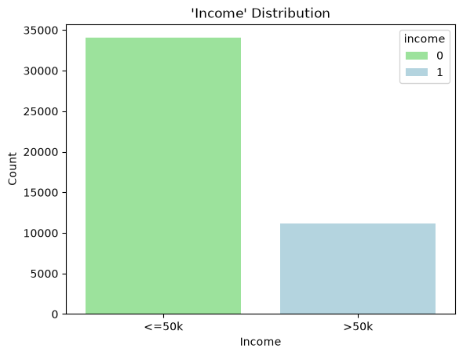
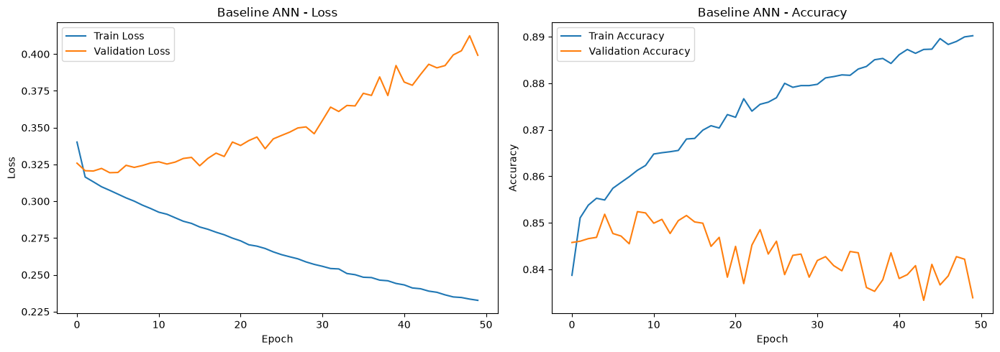
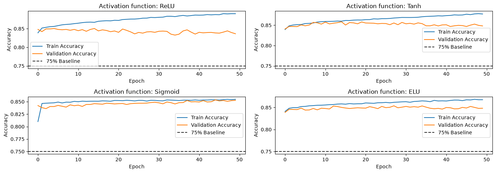
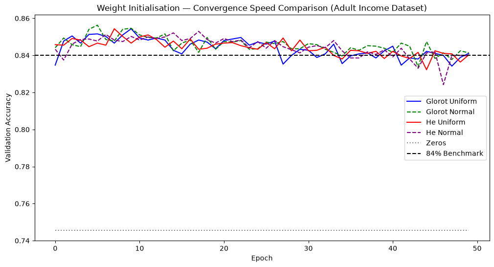
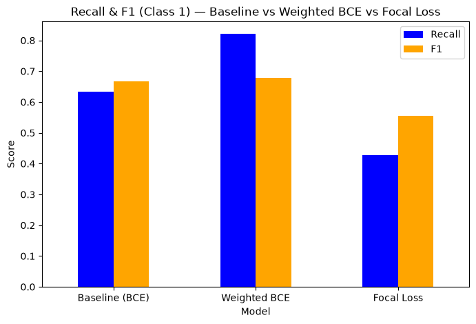
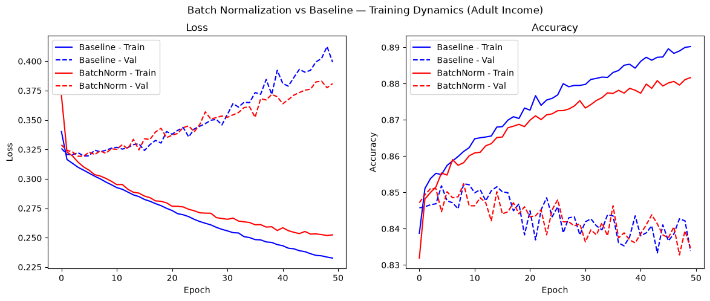
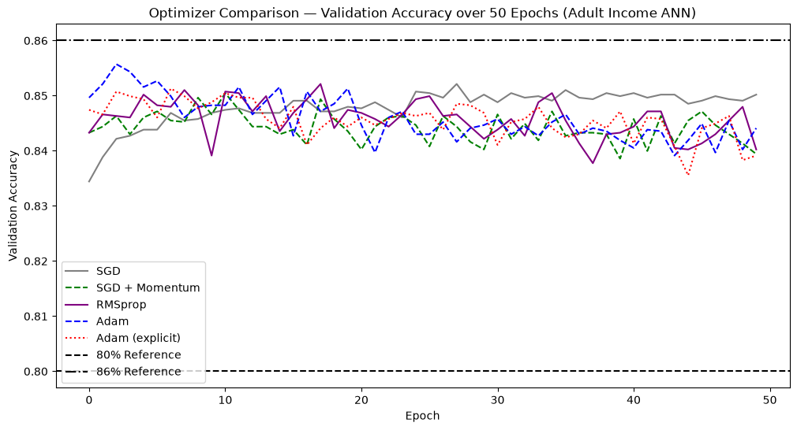

<div align="center">

# 💰 Adult Income Classification with Deep Learning
### A Systematic ANN Tuning Study — Activations, Initializers, Loss Functions, BatchNorm & Optimizers

[](https://www.python.org/)
[](https://www.tensorflow.org/)
[](https://keras.io/)
[](https://scikit-learn.org/)
[]()

*One dataset, one baseline architecture, seven controlled experiments — isolating exactly what each deep learning technique buys you.*

</div>

---

## 🧭 Table of Contents

- [📌 Overview](#-overview)
- [📋 The Dataset](#-the-dataset)
- [🗺️ Experiment Roadmap](#️-experiment-roadmap)
- [📊 Results at a Glance](#-results-at-a-glance)
- [🖼️ Visual Walkthrough](#️-visual-walkthrough)
- [🧠 Key Takeaways](#-key-takeaways)
- [⚙️ Tech Stack](#️-tech-stack)
- [🚀 Getting Started](#-getting-started)
- [📁 Repository Structure](#-repository-structure)
- [🙋 Author](#-author)

---

## 📌 Overview

This project uses the **UCI Adult Income dataset** (48,842 records) to predict whether someone
earns more or less than $50K/year — but the real goal isn't the prediction itself. It's a
controlled study of **why** each deep learning technique exists, built around one reusable
`build_ann()` architecture so every experiment isolates a single variable:

> `Baseline MLP` → `Activation Functions` → `Weight Initialization` → `Loss Functions` → `Batch Normalization` → `Optimizers` → `Final Combined Model`

Each task swaps exactly one component of the network and measures the effect — dead ReLU
neurons, vanishing gradients under Sigmoid, zero-initialization failure, class-imbalance-aware
losses, BatchNorm placement, and optimizer convergence speed are all demonstrated empirically,
not just described.

---

## 📋 The Dataset

<table>
<tr>
<td width="100%">

**UCI Adult / Census Income Dataset** — 48,842 rows, predicting whether income exceeds $50K/year
based on census attributes.

| Field | Detail |
|---|---|
| 🔢 Rows | 48,842 |
| 📋 Features | 14 (age, workclass, education, occupation, hours-per-week, etc.) |
| 🎯 Target | Binary — income `<=50K` (0) vs `>50K` (1) |
| ⚖️ Class Balance | Imbalanced — motivates the weighted-loss and focal-loss experiments in Task 5 |
| 🧹 Preprocessing | Whitespace stripped, `?` missing values handled, `fnlwgt`/`education` dropped as redundant, categoricals encoded, numerics scaled |

</td>
</tr>
</table>

---

## 🗺️ Experiment Roadmap

| # | Task | What Happens |
|---|------|--------------|
| 1️⃣ | **EDA & Preprocessing** | Missing-value handling, redundant column removal, target encoding, categorical encoding + scaling |
| 2️⃣ | **Baseline ANN** | A reusable `build_ann()` architecture (128→64) trained and evaluated as the control model |
| 3️⃣ | **Activation Functions** | ReLU / Sigmoid / Tanh / LeakyReLU compared head-to-head, including a dead-ReLU-neuron check and a sigmoid gradient-flow check |
| 4️⃣ | **Weight Initialization** | 5 initializers compared — including a deliberate all-zeros failure demonstration |
| 5️⃣ | **Loss Functions** | Binary Cross-Entropy vs. MSE-for-classification (wrong tool) vs. Weighted BCE vs. Focal Loss for class imbalance |
| 6️⃣ | **Batch Normalization** | With vs. without BatchNorm, plus a before-activation vs. after-activation placement experiment |
| 7️⃣ | **Optimizers** | SGD / Momentum / RMSprop / Adam compared, plus a learning-rate sensitivity sweep |
| 🏁 | **Final Combined Model** | Best-performing choices from every task merged into one production configuration |

---

## 📊 Results at a Glance

Seven model variants, benchmarked on the same held-out test set:

| Model | Activation | Init | Loss | BatchNorm | Optimizer | Test Acc | Precision(1) | Recall(1) | F1(1) | ROC-AUC |
|---|---|---|---|:---:|---|:---:|:---:|:---:|:---:|:---:|
| Baseline | ReLU | Glorot Uniform | BCE | ❌ | Adam | 0.8432 | 0.705 | 0.632 | 0.667 | 0.890 |
| Best Activation (ReLU) | ReLU | Glorot Uniform | BCE | ❌ | Adam | 0.8434 | 0.725 | 0.594 | 0.653 | 0.889 |
| Best Initializer (He Normal) | ReLU | He Normal | BCE | ❌ | Adam | 0.8443 | 0.699 | 0.654 | 0.676 | 0.894 |
| Weighted BCE | ReLU | He Normal | Weighted BCE | ❌ | Adam | 0.8067 | 0.578 | **0.821** | 0.678 | 0.894 |
| Focal Loss | ReLU | He Normal | Focal Loss | ❌ | Adam | 0.8300 | **0.790** | 0.427 | 0.555 | 0.888 |
| BatchNorm | ReLU | He Normal | BCE | ✅ | Adam | **0.8447** | 0.726 | 0.600 | 0.657 | 0.895 |
| **🏆 Final Combined** | ReLU | He Normal | Weighted BCE | ✅ | Adam | 0.8066 | 0.577 | 0.821 | 0.678 | **0.897** |

> 💡 No single model wins on every metric — that's the point. **Weighted BCE and Focal Loss
> trade raw accuracy for better recall on the minority (`>50K`) class**, which matters if the
> real goal is catching high-income individuals rather than maximizing overall accuracy. The
> Final Combined model reaches the highest ROC-AUC (0.897) by merging He Normal init +
> BatchNorm + class-weighted loss — showing these techniques compound rather than compete.

---

## 🖼️ Visual Walkthrough

<table>
<tr>
<td width="50%">

**Target Class Distribution**


</td>
<td width="50%">

**Baseline ANN — Training Curves**


</td>
</tr>
<tr>
<td width="50%">

**Activation Function Comparison (4-Panel)**


</td>
<td width="50%">

**Weight Initializer — Convergence Speed**


</td>
</tr>
<tr>
<td width="50%">

**Loss Function Comparison — BCE vs. Weighted vs. Focal**


</td>
<td width="50%">

**BatchNorm vs. Baseline**


</td>
</tr>
<tr>
<td width="50%">

**Optimizer Convergence — SGD vs. Momentum vs. RMSprop vs. Adam**


</td>
<td width="50%">

**Learning Rate Sensitivity — SGD vs. Adam**


</td>
</tr>
</table>

<details>
<summary>🔍 More plots from the notebook (click to expand)</summary>
<br>

<table>
<tr>
<td width="50%">

**Feature Distributions (EDA)**


</td>
<td width="50%">

**Baseline Confusion Matrix**


</td>
</tr>
<tr>
<td width="50%">

**Dead ReLU Neuron Check**


</td>
<td width="50%">

**Zeros Initialization Failure**


</td>
</tr>
<tr>
<td width="50%">

**Weight Distribution by Initializer**


</td>
<td width="50%">

**Precision / Recall by Loss Function**


</td>
</tr>
<tr>
<td width="50%">

**BatchNorm Placement — Before vs. After Activation**


</td>
<td width="50%">

**Learned BatchNorm Gamma / Beta**


</td>
</tr>
</table>

</details>

---

## 🧠 Key Takeaways

- **ReLU** consistently outperformed Sigmoid/Tanh in hidden layers, confirmed by a dedicated
  dead-neuron check that showed minimal neuron death at this network depth.
- **He Normal initialization** slightly outperformed Glorot Uniform for ReLU networks — and an
  all-zeros initializer demonstrably fails to break symmetry, confirming *why* random
  initialization matters at all.
- **MSE is measurably the wrong loss for classification** — using Binary Cross-Entropy instead
  produces sharper gradients and faster convergence on this task.
- **Weighted BCE and Focal Loss both trade accuracy for minority-class recall** — the right
  choice depends entirely on whether false negatives (missing high earners) are costlier than
  false positives.
- **BatchNorm improved both convergence stability and final accuracy**, with placement
  (before vs. after activation) making a measurable difference.
- **Adam converged fastest and most reliably** across the learning-rate sweep; SGD required much
  more careful tuning to reach comparable performance.

---

## ⚙️ Tech Stack

| Category | Tools |
|---|---|
| 🧠 Deep Learning | TensorFlow / Keras |
| 🤖 ML Utilities | scikit-learn (encoders, scalers, class weights, metrics) |
| 🐼 Data | pandas, NumPy |
| 📈 Visualization | Matplotlib, Seaborn |
| 📓 Environment | Jupyter Notebook |

---

## 🚀 Getting Started

```bash
# 1. Clone the repo
git clone https://github.com/krish-desai-123/Deep-Learning-.git
cd "Deep-Learning-/Adult Income PR2"

# 2. Create a virtual environment (recommended)
python -m venv venv
source venv/bin/activate      # Windows: venv\Scripts\activate

# 3. Install dependencies
pip install tensorflow scikit-learn pandas numpy matplotlib seaborn

# 4. Launch the notebook
jupyter notebook adult_income.ipynb
```

The notebook expects `adult.csv` inside a `Dataset/` folder in the working directory.

---

## 📁 Repository Structure

```
Adult Income PR2/
├── adult_income.ipynb       # Full notebook — all 7 tasks
├── README.md                 # You are here 👋
├── Dataset/
│   └── adult.csv
└── plots/                    # Exported figures used above
    ├── eda_target_distribution.png
    ├── baseline_training_curves.png
    ├── activation_comparison_4panel.png
    ├── initializer_convergence.png
    ├── loss_function_comparison.png
    ├── optimizer_convergence.png
    └── batchnorm_vs_baseline.png
```

---

## 🙋 Author

**Krish Desai** — [@krish-desai-123](https://github.com/krish-desai-123)

<div align="center">

*⭐ If this project helped you understand deep learning fundamentals, consider starring the repo!*

</div>
