<div align="center">

# 🎗️ Breast Cancer Diagnosis with Deep Learning
### From a Single Neuron to a Regularized, Dropout-Powered MLP


[](https://www.python.org/)
[](https://www.tensorflow.org/)
[](https://keras.io/)
[](https://scikit-learn.org/)
[]()

*A neural-network journey through the Breast Cancer Wisconsin (Diagnostic) dataset — SLP ➜ MLP ➜ Early Stopping ➜ Dropout ➜ Regularization ➜ Production Model.*

</div>

---

## 🧭 Table of Contents

- [📌 Overview](#-overview)
- [🩺 The Dataset](#-the-dataset)
- [🗺️ Project Roadmap](#️-project-roadmap)
- [📊 Results at a Glance](#-results-at-a-glance)
- [🖼️ Visual Walkthrough](#️-visual-walkthrough)
- [🩻 Clinical Insight](#-clinical-insight)
- [⚙️ Tech Stack](#️-tech-stack)
- [🚀 Getting Started](#-getting-started)
- [📁 Repository Structure](#-repository-structure)
- [🎥 Video Walkthrough](#-video-walkthrough)
- [🙋 Author](#-author)

---

## 📌 Overview

This project builds up a **binary classifier for breast cancer diagnosis** one deep learning
concept at a time. Starting from the simplest possible neural network — a **Single-Layer
Perceptron** — the notebook progressively layers on the techniques that separate a toy model
from a production-ready one:

> `Data Scaling` → `SLP` → `MLP` → `Activation Functions` → `Early Stopping` → `Dropout` → `L1 / L2 / ElasticNet Regularization` → `Final Combined Model`

Every technique is not just implemented but **explained** — the *why*, not just the *how* — and
benchmarked against a running leaderboard so you can see, in numbers, exactly what each
technique buys you.

---

## 🩺 The Dataset

<table>
<tr>
<td width="60%">

**Breast Cancer Wisconsin (Diagnostic) Dataset**, loaded directly from `sklearn.datasets` — no
CSV wrangling required.

| Field | Detail |
|---|---|
| 🔢 Samples | 569 (212 Malignant · 357 Benign) |
| 🧬 Features | 30 numeric cell-nucleus measurements |
| 🎯 Target | Binary — `0 = Malignant`, `1 = Benign` |
| 🧼 Missing values | None |
| 📦 Source | `sklearn.datasets.load_breast_cancer()` |

</td>
<td width="40%">

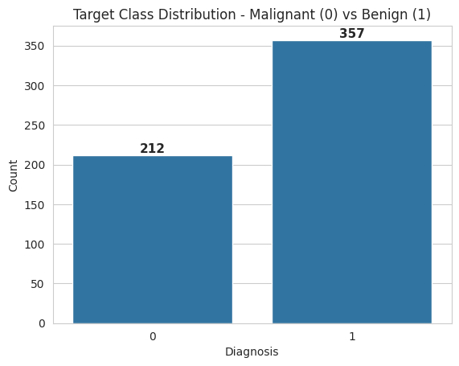

</td>
</tr>
</table>

Every feature was standardized with `StandardScaler` — **fit on the training split only** — so
gradient-based optimizers like Adam converge quickly and evenly across a 30-dimensional,
differently-scaled feature space.

---

## 🗺️ Project Roadmap

| # | Task | What Happens |
|---|------|--------------|
| 1️⃣ | **EDA & Preprocessing** | Class balance, correlation heatmap, stratified 80/20 split, `StandardScaler` |
| 2️⃣ | **Single-Layer Perceptron** | One neuron, one hyperplane — the honest baseline |
| 3️⃣ | **Multi-Layer Perceptron** | 64→32→1 network; ReLU vs. Tanh vs. Sigmoid head-to-head |
| 4️⃣ | **Early Stopping** | `patience=15`, `restore_best_weights=True` — stopping training at the *right* moment |
| 5️⃣ | **Dropout** | Rate sweep (0.1 / 0.3 / 0.5) to fight overfitting via randomized redundancy |
| 6️⃣ | **Regularization** | L1 (sparsity), L2 (shrinkage), and ElasticNet, compared side by side |
| 7️⃣ | **Final Model** | Dropout + L2 + Early Stopping combined into one production-ready model |

---

## 📊 Results at a Glance

Six models, one leaderboard. The **Dropout + Early Stopping** model came out on top on the test
set — proof that regularization techniques are complementary, not redundant.

| Model | Architecture | Regularization | Dropout | Early Stopping | Accuracy | Precision | Recall | F1 |
|---|---|:---:|:---:|:---:|:---:|:---:|:---:|:---:|
| SLP (Baseline) | 1 Dense (Sigmoid) | — | — | ❌ | 0.930 | 0.930 | 0.930 | 0.929 |
| MLP (Best: ReLU) | 2 Dense (ReLU) | — | — | ❌ | 0.965 | 0.966 | 0.965 | 0.965 |
| MLP + Early Stopping | 2 Dense (ReLU) | — | — | ✅ | 0.956 | 0.958 | 0.956 | 0.956 |
| **🏆 MLP + Dropout (0.3) + ES** | 2 Dense (ReLU) + Dropout | — | 0.3 | ✅ | **0.974** | **0.974** | **0.974** | **0.974** |
| MLP + L2 Regularization | 2 Dense (ReLU) | L2 (0.001) | — | ✅ | 0.956 | 0.958 | 0.956 | 0.956 |
| Final Combined Model | 2 Dense (ReLU) + Dropout | L2 (0.001) | 0.3 | ✅ | 0.956 | 0.958 | 0.956 | 0.956 |

> 💡 On this small (569-row), well-separated dataset, **Dropout interrupted memorization** more
> effectively than weight-shrinkage alone — a great illustration of *why* the choice of
> regularizer should match the failure mode you're actually seeing.

---

## 🖼️ Visual Walkthrough

<table>
<tr>
<td width="50%">

**Feature Correlation Heatmap**
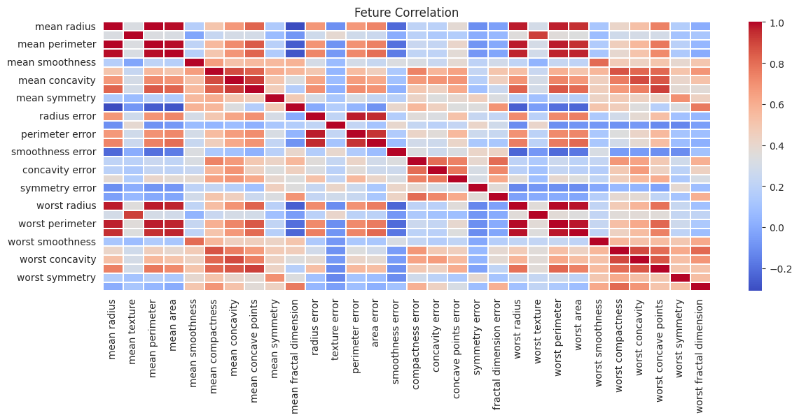

</td>
<td width="50%">

**SLP Training Curves (Loss + Accuracy)**
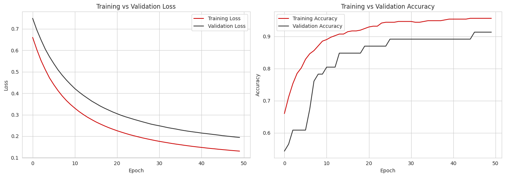

</td>
</tr>
<tr>
<td width="50%">

**ReLU vs. Tanh vs. Sigmoid — MLP Accuracy**
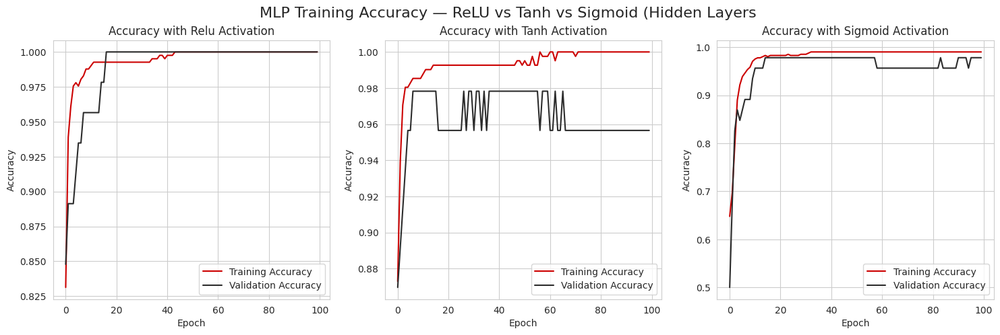

</td>
<td width="50%">

**Early Stopping — Val Loss with Best Epoch Marked**
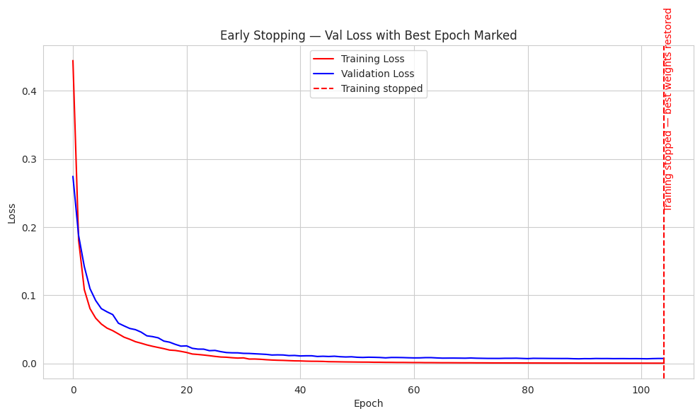

</td>
</tr>
<tr>
<td width="50%">

**Early Stopping vs. No Callback**
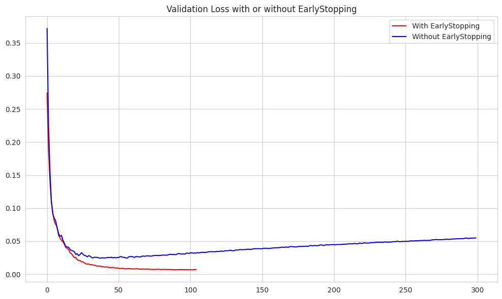

</td>
<td width="50%">

**Dropout Rate Comparison (0.1 / 0.3 / 0.5)**
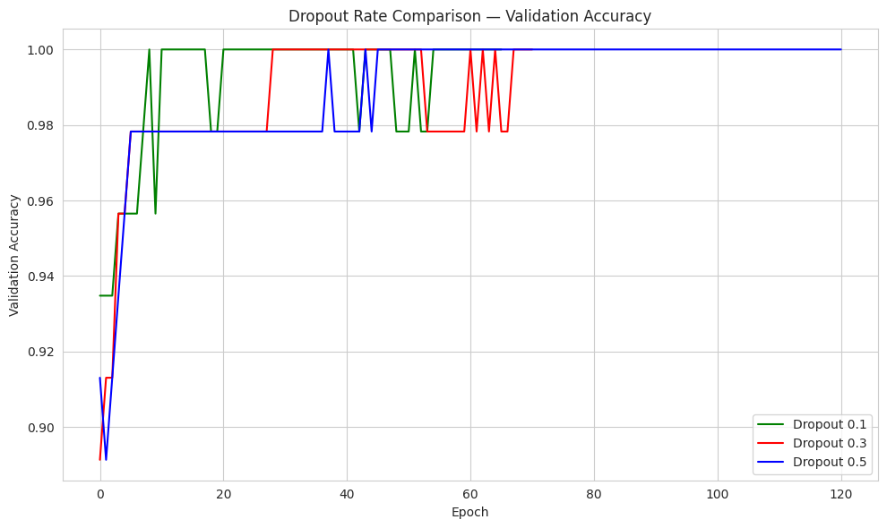

</td>
</tr>
<tr>
<td width="50%">

**L1 vs. L2 vs. ElasticNet — Loss Curves**
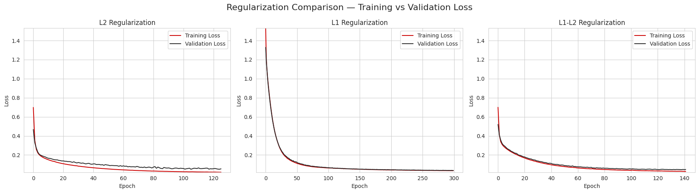

</td>
<td width="50%">

**Final Test Accuracy Comparison**
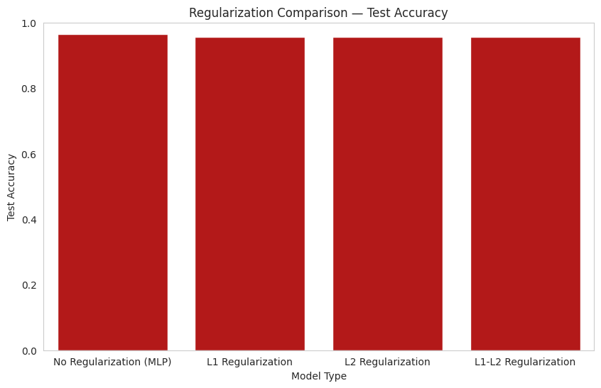

</td>
</tr>
</table>

<details>
<summary>🔍 Confusion Matrices (click to expand)</summary>
<br>

<table>
<tr>
<td width="50%">

**SLP Confusion Matrix**
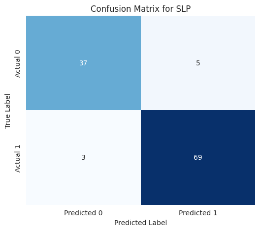

</td>
<td width="50%">

**Best MLP (ReLU) Confusion Matrix**
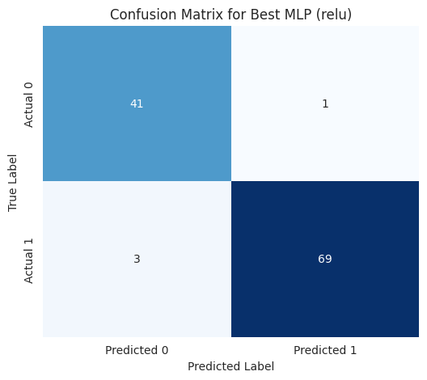

</td>
</tr>
</table>

</details>

---

## 🩻 Clinical Insight

> **In cancer diagnosis, a false negative is far more costly than a false positive.**
> Missing a malignant tumor delays treatment — a false alarm just means a follow-up test.

- **Recommended model:** the Final Combined Model (Dropout + L2 + Early Stopping) — the most
  robust to unseen patients, since it stacks every generalization technique studied here.
- **Threshold:** the default `0.5` cutoff is *not* appropriate for screening. The decision
  threshold should be shifted so the model favors flagging "Malignant" unless it's highly
  confident otherwise — pushing Malignant-class recall toward ~99%+ even at the cost of more
  false positives that a human clinician can rule out.
- **Biggest generalization win:** **Dropout + Early Stopping**, which directly interrupts the
  network's tendency to memorize a small (569-row) training set — more effective here than
  weight-shrinkage alone.

---

## ⚙️ Tech Stack

| Category | Tools |
|---|---|
| 🧠 Deep Learning | TensorFlow / Keras |
| 🤖 ML Utilities | scikit-learn (`StandardScaler`, `train_test_split`, metrics) |
| 🐼 Data | pandas, NumPy |
| 📈 Visualization | Matplotlib, Seaborn |
| 📓 Environment | Jupyter Notebook |

```
tensorflow>=2.12.0
scikit-learn>=1.4.0
pandas>=2.0.0
numpy>=1.24.0
matplotlib>=3.7.0
seaborn>=0.12.0
```

---

## 🚀 Getting Started

```bash
# 1. Clone the repo
git clone https://github.com/krish-desai-123/Deep-Learning-.git
cd "Deep-Learning-/Breast Cancer PR1"

# 2. Create a virtual environment (recommended)
python -m venv venv
source venv/bin/activate      # Windows: venv\Scripts\activate

# 3. Install dependencies
pip install -r requirements.txt

# 4. Launch the notebook
jupyter notebook DL_PR1.ipynb
```

No dataset download needed — `load_breast_cancer(as_frame=True)` pulls everything straight from
scikit-learn. 🎉

---

## 📁 Repository Structure

```
Breast Cancer PR1/
├── DL_PR1.ipynb          # Full notebook — all 7 tasks
├── DL_PR1.html            # Static HTML export
├── requirements.txt        # Pinned dependencies
├── README.md               # You are here 👋
└── plots/                  # Exported figures used above
    ├── class_distribution.png
    ├── correlation_heatmap.png
    ├── slp_training_curves.png
    ├── slp_confusion_matrix.png
    ├── activation_comparison.png
    ├── mlp_confusion_matrix.png
    ├── earlystopping_curve.png
    ├── es_vs_no_es.png
    ├── dropout_rate_comparison.png
    ├── regularization_comparison.png
    └── test_accuracy_barchart.png
```


## 🙋 Author

**Krish Desai** — [@krish-desai-123](https://github.com/krish-desai-123)


<div align="center">

*⭐ If this project helped you understand deep learning fundamentals, consider starring the repo!*

</div>
