<div align="center">

# 👁️ Computer Vision Fundamentals to Real-Time Detection
### OpenCV Image Processing → YuNet Face Detection → YOLOv8 Object Detection → Integrated Pipeline

[](https://www.python.org/)
[](https://opencv.org/)
[](https://docs.ultralytics.com/)
[]()

*From morphological operations on binary images to a live, FPS-benchmarked face + object detection pipeline running on webcam.*

</div>

---

## 🧭 Table of Contents

- [📌 Overview](#-overview)
- [🗺️ Project Roadmap](#️-project-roadmap)
- [🖼️ Visual Walkthrough](#️-visual-walkthrough)
- [📊 Final Technique Comparison](#-final-technique-comparison)
- [⚡ Real-Time FPS Benchmark](#-real-time-fps-benchmark)
- [🧠 Key Takeaways](#-key-takeaways)
- [⚙️ Tech Stack](#️-tech-stack)
- [🚀 Getting Started](#-getting-started)
- [📁 Repository Structure](#-repository-structure)
- [🙋 Author](#-author)

---

## 📌 Overview

This project builds up computer vision skills layer by layer — starting from raw pixel-level
operations in OpenCV and ending with a real-time, webcam-driven detection pipeline combining a
CNN-based face detector and a CNN-based object detector running side by side:

> `Image I/O & Morphology` → `Bitwise Ops & Histograms` → `YuNet Face Detection` → `YOLOv8 Object Detection` → `Integrated Real-Time Pipeline + FPS Benchmark`

Every technique is demonstrated on real images and a live webcam feed — not just described —
including a practical privacy use-case (automatic face blurring) and a rigorous FPS comparison
between running face detection alone, object detection alone, and both together.

---

## 🗺️ Project Roadmap

| # | Task | What Happens |
|---|------|--------------|
| 1️⃣ | **Environment Setup, Image I/O & Morphology** | Grayscale/color loading, binary thresholding, erosion/dilation/opening/closing, kernel shape & size comparison on noisy images |
| 2️⃣ | **Bitwise Operations & Histograms** | AND/OR/XOR/NOT on binary masks, a masked-overlay use case, grayscale & per-channel color histograms, brightness/contrast analysis |
| 3️⃣ | **Face Detection with YuNet** | OpenCV 5.0's built-in YuNet CNN face detector — static images, real-time webcam, a confidence-threshold experiment, and a privacy-blur use case |
| 4️⃣ | **Object Detection with YOLOv8** | Pretrained YOLOv8n on static images and webcam, plus confidence-threshold and IoU-threshold tuning experiments |
| 5️⃣ | **Integrated Pipeline & Final Comparison** | YuNet + YOLO running together on live webcam frames, FPS-benchmarked individually and combined, with a final technique comparison table |

---

## 🖼️ Visual Walkthrough

<table>
<tr>
<td width="50%">

**Image I/O — Color Image Loaded**
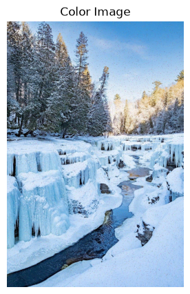

</td>
<td width="50%">

**Morphological Operations (Erode / Dilate / Open / Close)**
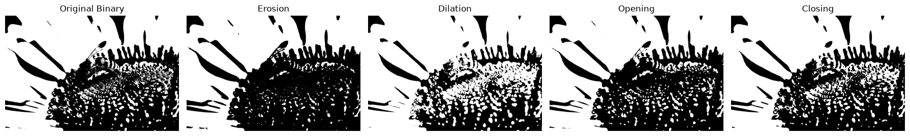

</td>
</tr>
<tr>
<td width="50%">

**Bitwise Operations — AND / OR / XOR / NOT**
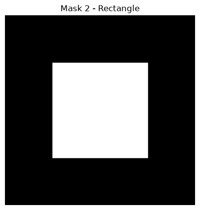

</td>
<td width="50%">

**Brightness vs. Contrast — Histogram Shift**
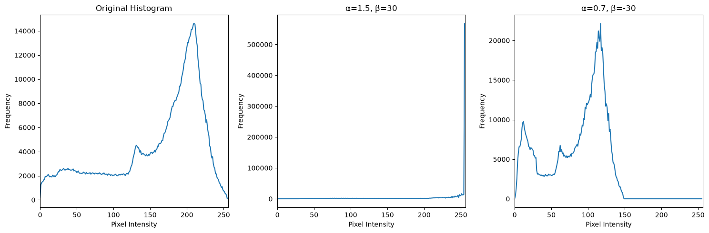

</td>
</tr>
<tr>
<td width="50%">

**YuNet Face Detection — Bounding Box + Landmarks**
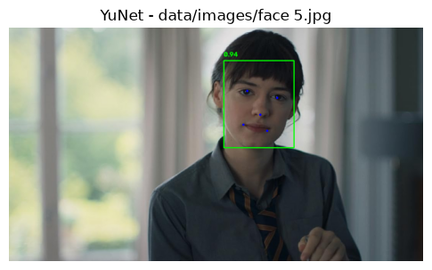

</td>
<td width="50%">

**Privacy Use-Case — Automatic Face Blurring**
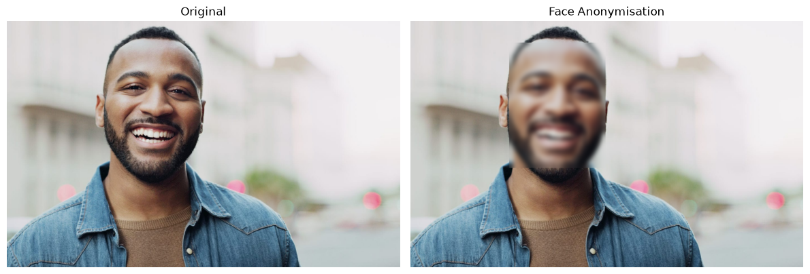

</td>
</tr>
<tr>
<td width="50%">

**YOLOv8 Object Detection — Multi-Class**
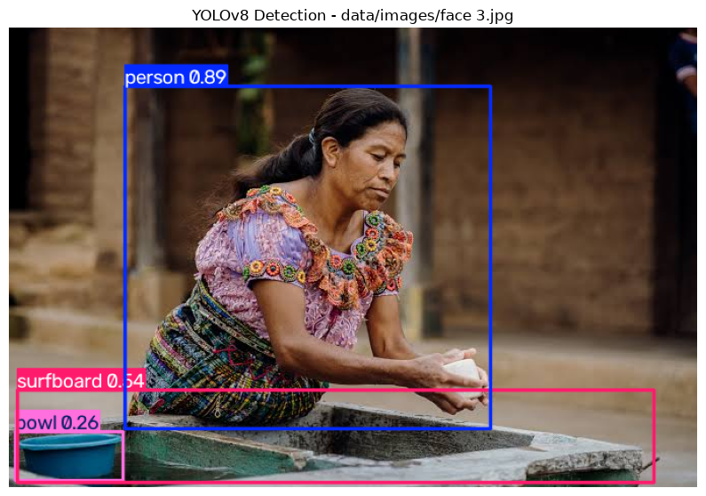

</td>
<td width="50%">

**IoU Threshold Comparison**
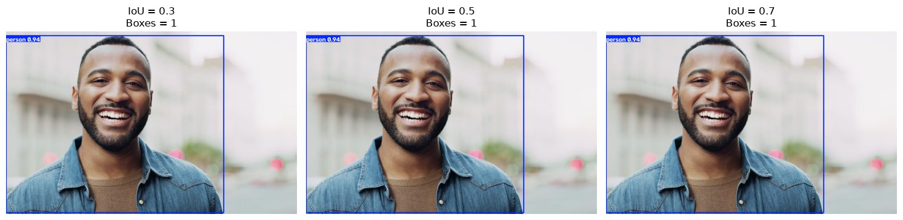

</td>
</tr>
</table>

<details>
<summary>🔍 More plots from the notebook (click to expand)</summary>
<br>

<table>
<tr>
<td width="50%">

**Kernel Shape & Size Comparison on Noisy Images**
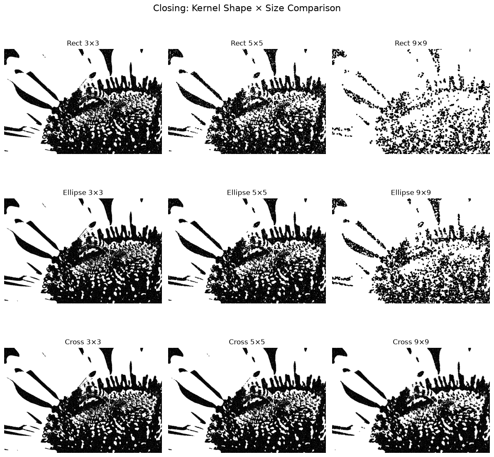

</td>
<td width="50%">

**Masked Overlay Use-Case**
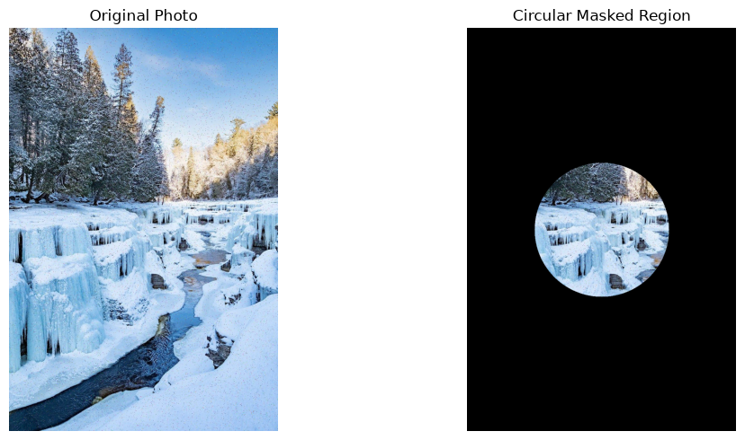

</td>
</tr>
<tr>
<td width="50%">

**Brightness / Contrast Adjustment**
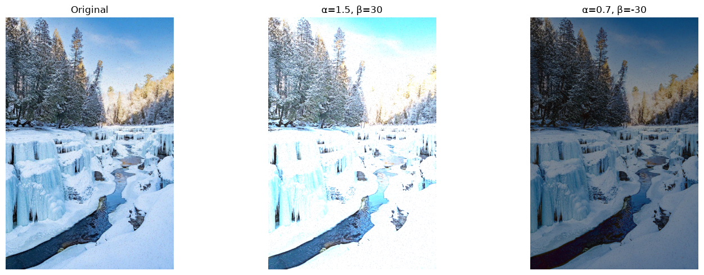

</td>
<td width="50%">

**YuNet Score-Threshold Experiment**
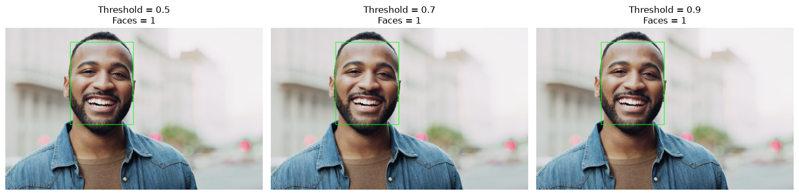

</td>
</tr>
<tr>
<td width="50%">

**YOLOv8 Single-Image Detection**
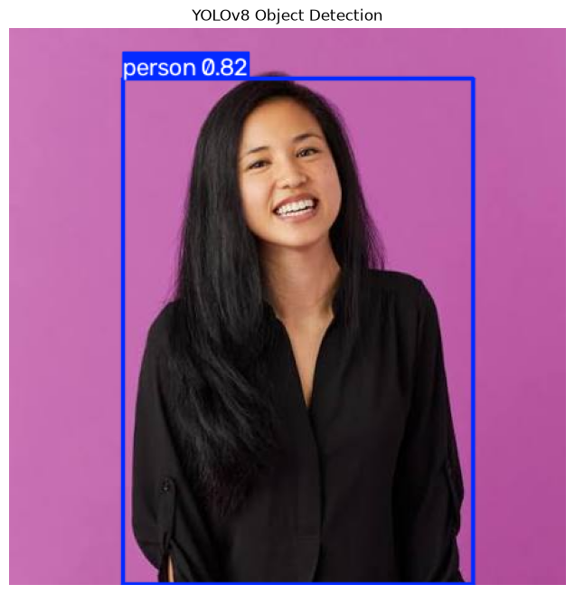

</td>
<td width="50%">

**YOLO Confidence Threshold Effect**
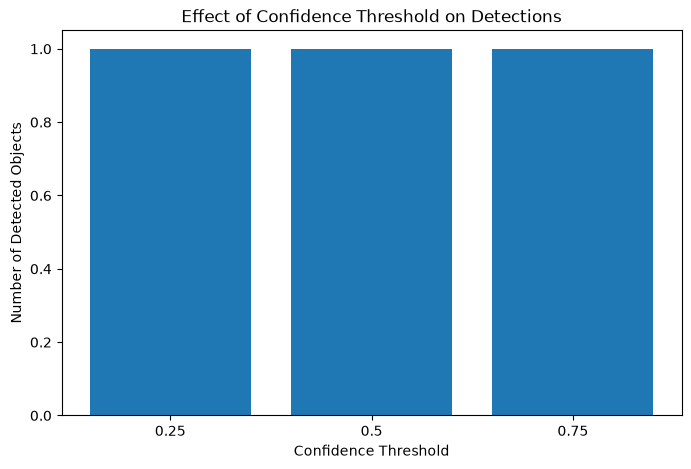

</td>
</tr>
<tr>
<td width="50%">

**YOLO IoU Threshold Effect**
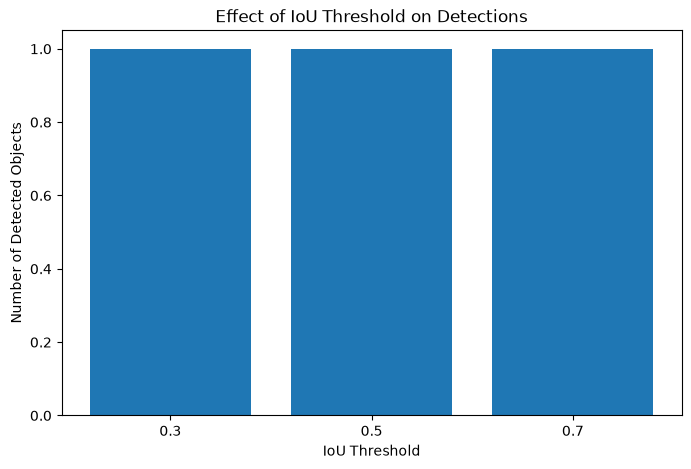

</td>
<td width="50%">

</td>
</tr>
</table>

</details>

---

## 📊 Final Technique Comparison

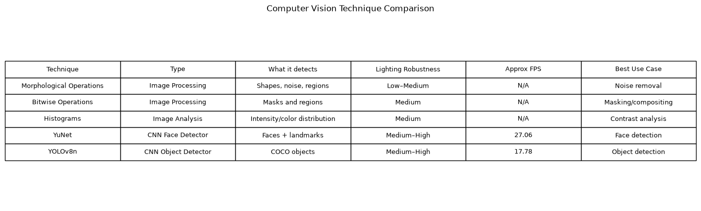

| Technique | Type | Detects | Lighting Robustness | Approx. FPS | Best Use Case |
|---|---|---|---|---|---|
| Morphological Operations | Image Processing | Shapes, noise, regions | Low–Medium | N/A | Noise removal |
| Bitwise Operations | Image Processing | Masks and regions | Medium | N/A | Masking / compositing |
| Histograms | Image Analysis | Intensity / color distribution | Medium | N/A | Contrast analysis |
| YuNet | CNN Face Detector | Faces + landmarks | Medium–High | ~27 | Face detection |
| YOLOv8n | CNN Object Detector | COCO objects | Medium–High | ~18 | Object detection |

---

## ⚡ Real-Time FPS Benchmark

100 live webcam frames were captured and run through each detection pipeline to measure
real-world throughput:

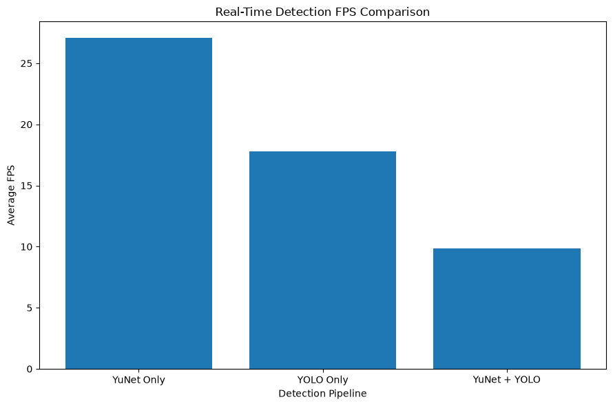

| Pipeline | Average FPS |
|---|:---:|
| YuNet Only | **27.06** |
| YOLO Only | **17.78** |
| YuNet + YOLO Combined | **9.83** |

> 💡 Running both detectors on every frame roughly halves throughput compared to YOLO alone —
> a direct, measured illustration of the compute cost of stacking CNN-based models in a
> real-time pipeline.

---

## 🧠 Key Takeaways

- **Morphological operations behave predictably on synthetic noise** — opening removes salt
  noise, closing fills pepper noise, and kernel shape/size directly trades off noise removal
  against detail preservation.
- **YuNet is lightweight and fast** (~27 FPS standalone) while still returning 5-point facial
  landmarks alongside the bounding box — well suited to privacy-preserving use cases like
  automatic face blurring.
- **YOLOv8n trades some speed for richer detection** — it recognizes arbitrary COCO classes
  (not just faces), at roughly two-thirds the FPS of YuNet.
- **Confidence and IoU thresholds are real tuning levers**, not just defaults — both were swept
  and visibly changed detection counts on the same image.
- **Combining two CNN-based detectors on every frame is expensive** — the measured 9.83 FPS for
  the combined pipeline versus 27/18 FPS standalone quantifies exactly why real-time systems
  often run detectors on alternating frames or in parallel threads rather than sequentially.

---

## ⚙️ Tech Stack

| Category | Tools |
|---|---|
| 👁️ Computer Vision | OpenCV 5.0 (image processing, YuNet face detector) |
| 🎯 Object Detection | Ultralytics YOLOv8 (YOLOv8n pretrained) |
| 🐼 Data / Math | NumPy |
| 📈 Visualization | Matplotlib |
| 📷 Real-Time Input | OpenCV `VideoCapture` (webcam) |
| 📓 Environment | Jupyter Notebook |

---

## 🚀 Getting Started

```bash
# 1. Clone the repo
git clone https://github.com/krish-desai-123/Deep-Learning-.git
cd "Deep-Learning-/CV PR3"

# 2. Create a virtual environment (recommended)
python -m venv venv
source venv/bin/activate      # Windows: venv\Scripts\activate

# 3. Install dependencies
pip install opencv-python numpy matplotlib ultralytics

# 4. Launch the notebook
jupyter notebook cv.ipynb
```

The notebook expects `data/images/` (sample photos) and `data/models/` (YuNet ONNX + YOLOv8n
weights) inside the project folder — both are included in this repo. Webcam-dependent cells
(real-time detection, FPS benchmark) require a connected camera to reproduce live; static-image
cells run without one.

---

## 📁 Repository Structure

```
CV PR3/
├── cv.ipynb                  # Full notebook — all 5 tasks
├── README.md                 # You are here 👋
├── data/
│   ├── images/
│   │   ├── image 1.jpg
│   │   ├── image 2.jpg
│   │   └── face 1.jpg ... face 5.jpg
│   └── models/
│       ├── face_detection_yunet_2023mar.onnx
│       └── yolov8n.pt
└── plots/                    # Exported figures used above
    ├── grayscale_color_load.png
    ├── morphological_ops.png
    ├── kernel_shape_comparison.png
    ├── bitwise_operations.png
    ├── masked_overlay.png
    ├── brightness_contrast.png
    ├── histogram_comparison.png
    ├── yunet_face_detection.png
    ├── threshold_experiment.png
    ├── privacy_blur_usecase.png
    ├── yolo_detection_single.png
    ├── yolo_detection_batch.png
    ├── confidence_threshold_chart.png
    ├── iou_threshold_chart.png
    ├── iou_visual_comparison.png
    ├── fps_benchmark_chart.png
    └── technique_comparison_table.png
```

---

## 🙋 Author

**Krish Desai** — [@krish-desai-123](https://github.com/krish-desai-123)

<div align="center">

*⭐ If this project helped you understand computer vision fundamentals, consider starring the repo!*

</div>
